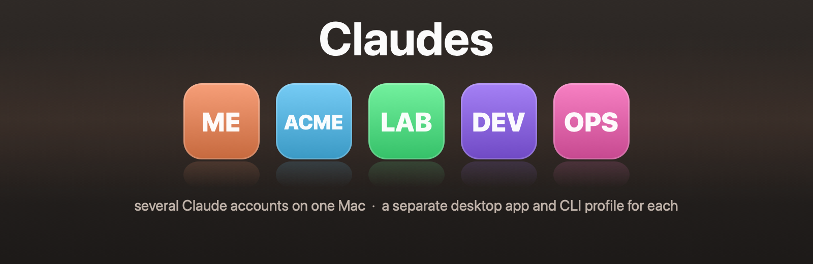

<p align="center">
  
</p>

# Claudes

Run several Claude accounts side by side on one Mac — a separate desktop app and
CLI profile per organisation, all usable at the same time.

Instances are defined **only** in `instances.conf`. No script here names a
specific organisation, and nothing depends on where this directory lives, so it
can be moved, copied to another machine, or committed to git.

`instances.conf` is gitignored — slugs and organisation names are private to a
machine. On a fresh clone, one command does the whole setup:

```bash
./install.sh
```

The first run copies `instances.conf.example` to `instances.conf` and stops, so
you can put your own organisations in it. Run it again and it generates the
`~/.local/bin` commands and builds every app the config defines. It never builds
from the example — those rows are placeholders.

After that first run the command is on your PATH as `claude-install`, and
re-running it is safe: apps that already exist are skipped unless you pass
`--force`. `--check` reports what it would do and changes nothing.

The default `/Applications/Claude.app` and `~/.claude` are the personal profile.
This tooling never modifies them.

## Requirements

macOS, the Claude desktop app, and the Xcode command line tools
(`xcode-select --install`) for `swift`. Nothing else — icon rendering uses
CoreImage and AppKit, so there is no ImageMagick or other third-party
dependency. The scripts check this up front and fail with a clear message.

Paths can be overridden if your setup differs:

| Variable | Default |
|---|---|
| `CLAUDE_APPS_MAIN_APP` | `/Applications/Claude.app` |
| `CLAUDE_APPS_DIR` | `/Applications` (where clones are created) |
| `CLAUDE_APPS_BIN` | `~/.local/bin` (where commands are installed) |

`claude-sync` warns if the command directory is not on your `PATH`.

## How isolation works

Each instance gets two separate things, both set by a wrapper installed at
`Contents/MacOS/Claude` inside its app bundle:

- `CLAUDE_CONFIG_DIR=~/.claude-<slug>` — credentials, settings, skills, plugins
  and session history for the Code side.
- `--user-data-dir=~/Library/Application Support/Claude-<label>` — the Electron
  app's own login, cookies and window state.

Because the wrapper lives inside the bundle, the desktop apps need no shell
configuration at all. The `~/.local/bin` commands exist only for terminal use.

## Which Claude opens a link

Isolation stops at the bundle. Every clone inherits the `claude` URL scheme from
the original app, and macOS allows exactly **one** default handler per scheme for
the whole login session — there is no per-browser, per-profile or per-window
routing to configure. So a `claude://` link from the browser, including a sign-in
callback, goes to whichever app is currently the default, no matter which
instance started the flow.

```bash
claude-default           # show the current handler and all the candidates
claude-default <slug>    # send claude:// links to that instance
claude-default personal  # send them back to /Applications/Claude.app
```

Point it at an instance *before* signing into that instance, then put it back if
you like. The switch is immediate and needs no restart.

A rebuild re-registers the bundle with LaunchServices, so check with
`claude-default` afterwards if links start landing in the wrong app.

The same collision applies to `msauth.com.anthropic.claudefordesktop`, the
Microsoft SSO callback scheme — but ad-hoc signing already breaks Microsoft SSO
in the clones, so it is moot there.

## Commands

Generated into `~/.local/bin` by `claude-sync`.

| Command | Does |
|---|---|
| `claude-install` | set up everything the config defines (`--check`, `--force`) |
| `claude-instances` | list every instance and its current state |
| `claude-<slug>` | run the CLI under that instance's config dir |
| `claude-<slug>-app` | open that instance's desktop app |
| `claude-<slug>-signed` | open that profile with the original signed `Claude.app` |
| `claude-update-all` | update the CLI, rebuild stale apps (`--check`, `--force`) |
| `claude-rebuild <slug> [hue]` | rebuild one app from the current `Claude.app` |
| `claude-icon <slug> [hue]` | re-skin an app without a full rebuild |
| `claude-default [slug]` | choose which Claude opens `claude://` links |
| `claude-signed [slug on\|off]` | run an instance with the original signed binary |
| `claude-remove <slug>` | remove an instance: app, commands, config row (`--purge`) |
| `claude-sync` | regenerate the commands after editing `instances.conf` |

## Adding or changing an instance

Edit `instances.conf`, then:

```bash
claude-install           # refresh commands, build whatever is missing
```

Or do the two halves separately, which is what `claude-install` calls:

```bash
claude-sync              # refresh ~/.local/bin commands
claude-rebuild <slug>    # build one app
```

## Removing an instance

```bash
claude-remove <slug>            # app + commands + instances.conf row; profile kept
claude-remove <slug> --purge    # also delete the profile — not recoverable
```

It prints exactly what it will delete, with sizes, and asks you to type the slug
back before touching anything (`--yes` skips the prompt for scripts). There is no
need to edit `instances.conf` first — it removes the row for you.

`--purge` also takes the per-bundle-id state macOS keeps outside both: the
preferences plist, the two `Caches` directories and `HTTPStorages` (cookies).
Deleting only the app leaves those behind under a bundle id nothing will ever
claim again. `defaults delete` runs first, because `cfprefsd` caches preferences
in memory and would otherwise rewrite the plist after it is deleted.

Without `--purge` the two profile directories survive, so re-adding the row and
running `claude-rebuild <slug>` picks up the same logins and history. `--purge`
deletes `~/.claude-<slug>` and the Electron user-data dir: chat history, settings
and login state, gone for good.

`--purge` works as a later, separate step too. Each build leaves a
`.claude-apps-instance` stamp in the config dir recording the slug's label, which
is how a purge still finds `Claude-<label>` in *Application Support* after the app
and the config row are already gone.

An **orphan** — an app on disk that `instances.conf` no longer mentions, typically
left by editing the file by hand — is removed the same way: `claude-remove` reads
the bundle identifier rather than the config, so the slug is enough.
`claude-update-all` reports orphans it finds.

Removal is safe to repeat: a second run finds nothing to do and exits 0. The
command only ever deletes `~/.local/bin` files carrying this tooling's
generated-by marker, so hand-written scripts there are left alone, and every
deletion goes through a guard that refuses `/`, `$HOME`, `/Applications/Claude.app`
and `~/.claude`.

## Files

| File | Purpose |
|---|---|
| `instances.conf` | the only place instances are defined (**gitignored**) |
| `instances.conf.example` | tracked template to copy from |
| `install.sh` | first-run setup: config, commands, then every missing app |
| `lib.sh` | config parsing and shared helpers |
| `rebuild-claude-org.sh` | clone, rebrand, re-sign and re-skin one app |
| `set-claude-icon.sh` | icon only; much faster than a full rebuild |
| `set-default-handler.sh` | pick the app that opens `claude://` links |
| `set-binary-mode.sh` | clone binary vs. the original signed one, per instance |
| `url-handler.swift` | reads and sets a scheme's default app via LaunchServices |
| `render-icon.swift` | tints and badges an `.iconset` (CoreImage + AppKit) |
| `update-all.sh` | the three update tracks, in order |
| `list-instances.sh` | status table |
| `sync-commands.sh` | generate `~/.local/bin` commands |
| `remove-instance.sh` | remove one instance (or an orphan), optionally its data |
| `render-banner.swift` | regenerates `docs/banner.png` (`swift render-banner.swift docs/banner.png`) |
| `LICENSE` | MIT |

## Idempotency

Every command is safe to run repeatedly; none of them needs a clean starting
state.

- `claude-rebuild` deletes the old clone and re-clones from the pristine
  `Claude.app` every time, so a rebuild is a fresh build, never a patch on top of
  a patch. The profile directories are created if missing and never overwritten.
- `claude-icon` and the icon step of a rebuild always render from the untouched
  `Claude.app` icon, so re-running never compounds a tint or a badge.
- `claude-sync` regenerates all of its commands from `instances.conf` and prunes
  the ones it previously generated for instances that are gone. Two consecutive
  runs leave `~/.local/bin` byte-identical.
- `claude-update-all` rebuilds only apps whose version has drifted from
  `Claude.app`; when everything matches it changes nothing. `--check` is a pure
  dry run, `--force` rebuilds regardless.
- `claude-remove` exits 0 with "nothing - already removed" when run again.
- `claude-install` skips apps that already exist, so re-running it after adding a
  row to `instances.conf` builds only the new one. It never overwrites an
  existing `instances.conf`.

## Updating

`Claude.app` auto-updates itself; clones cannot, because they are ad-hoc signed
copies. Let the original update first, then:

```bash
claude-update-all
```

It compares each app's `CFBundleShortVersionString` against the original's and
rebuilds only what has drifted.

Three things update on independent schedules:

1. **Terminal CLI** — one install shared by every profile. Only the config dir
   differs between `claude` and `claude-<slug>`; the binary is the same, so it is
   updated once. If Homebrew owns it, `claude-update-all` upgrades it; otherwise
   it tells you the command for your install method rather than guessing.
2. **Desktop app bundles** — the original auto-updates, clones are rebuilt.
3. **claude-code inside each desktop app** — lives in that app's user-data-dir and
   self-updates. A rebuild replaces only the `.app` bundle, so these survive it.
   They often run *ahead* of the CLI install.

## Gotchas this tooling works around

Each of these cost real debugging time. Do not remove the workarounds.

- **`CFBundleIconName`.** macOS prefers the icon named by this key inside
  `Assets.car` over `CFBundleIconFile`, silently ignoring a replaced
  `electron.icns`. The scripts delete the key to force the fallback. Verify what
  the system actually resolves with `NSWorkspace.icon(forFile:)` — the file on
  disk can be correct while the Dock still shows the old icon.
- **Electron helper apps.** Electron resolves its helper processes at
  `Frameworks/<CFBundleName> Helper.app`. Renaming the bundle without renaming
  the helpers makes the app die at launch with
  `FATAL: Unable to find helper app`.
- **Inside-out signing.** Sign frameworks and helpers first, the outer bundle
  last, and never use `codesign --deep`. Restricted entitlements
  (`keychain-access-groups`, `application-identifier`) cannot be carried by an
  ad-hoc signature and are dropped; they only affect WebAuthn and Microsoft SSO.
- **`ditto`, not `cp -R`**, for copying a bundle — it preserves bundle metadata.
- **Icon rendering is Swift, not ImageMagick.** Some ImageMagick builds ship
  without FreeType and silently cannot draw text at all, so tint and badge are
  both done with CoreImage/AppKit. That also keeps the repo dependency-free.
- **zsh `set -e` and `(( n++ ))`.** Post-increment evaluates to the *old* value,
  so the first iteration returns 0 and aborts the script. Use `n=$((n+1))`.
- **zsh `[[ x == [a-z]## ]]`** silently never matches unless `EXTENDED_GLOB` is
  set. `lib.sh` uses `=~` regex instead.
- **zsh `print` eats leading dashes.** `print "--purge ..."` parses `-p` as an
  option and fails with `no coprocess`, which under `set -e` kills the script.
  Any `print` whose text starts with a variable or a `-` uses `print -r --`.
- **Never `local path=...` in zsh.** `$path` is tied to `$PATH`, so a scalar
  assignment wipes the command search path for the rest of the function and every
  later command fails with `command not found`. `safe_rm` uses `target`.
- **Unmatched globs abort a zsh script.** `for f in dir/*` is fatal when nothing
  matches — the fresh-machine case. The loops here use the `(N)` qualifier.
- **PlistBuddy talks on stdout.** A missing file or key produces
  `File Doesn't Exist, Will Create...` on *stdout*, which silently becomes your
  captured value. `bundle_version` checks the file first and discards the output.

## What ad-hoc signing costs you

A clone is re-signed ad hoc, and an ad-hoc signature carries **no entitlements at
all** — the original is signed by Anthropic with `keychain-access-groups`,
`application-identifier` and a team identifier that only they can claim. Apple's
provisioning is what makes those valid, so no amount of re-signing here can
restore them, and there is no macOS setting that grants them: this is a property
of the binary's signature, not a permission you approve.

What actually breaks in a clone:

- **Linking a remote session to this computer.** The app logs
  `remote_cowork.device_register_miss {"reason":"unavailable_entitlement"}` and
  the session shows *"Couldn't link this session to a computer, so attached
  folders can't be used."* Local sessions started in the app are unaffected.
- **Microsoft SSO and WebAuthn**, which need the keychain access group.

The escape hatch is to run the *original* signed binary against an instance's
profile. Same config dir, same login, same history — only the executable differs,
so the entitlements are intact. Either keep clicking the same Dock icon:

```bash
claude-signed            # show every instance's mode
claude-signed xpt on     # that icon now launches /Applications/Claude.app
claude-signed xpt off    # back to the clone's own binary
```

or start it from the terminal for one session:

```bash
claude-xpt-signed
```

The switch is a marker file in the instance's config dir, read by the launcher
inside the app bundle, so flipping it needs no rebuild and no re-signing. An app
built before the switch existed ignores it — `claude-signed` says so and tells you
to run `claude-rebuild <slug>` once.

The cost is cosmetic, and it is worth being precise about it: **launching** still
works from the tinted icon, but the running process belongs to `Claude.app`.
LaunchServices registers it as plain "Claude", so the Dock and the app switcher
show the untinted icon while it runs, and two instances in signed mode look alike.

One profile, one process: quit the instance before starting it the other way, as
Electron locks the user-data dir.

**A signed-mode instance and the personal `Claude.app` cannot be open at the same
time.** In signed mode they are the same bundle, so launching the second one ends
both — the log shows two `beforeQuit` sequences and you are left with neither.
Quit one before opening the other. This does not affect clone-mode instances,
which coexist with the personal app and with each other as they always have.

## What is not isolated

The wrapper isolates the config dir and the Electron user-data dir. Two things
it does not reach:

- **`~/Library/Logs/Claude`** is shared by every instance. Electron derives the
  log path from the application name it was built with, not from the bundle or
  the user-data dir, so all instances interleave into one `main.log`. Useful to
  know when reading logs; harmless otherwise.
- **The `claude://` URL scheme**, which has one system-wide handler — see
  [Which Claude opens a link](#which-claude-opens-a-link).

Per-bundle-id state (preferences, caches, cookies) *is* separate, because each
clone gets its own `CFBundleIdentifier`. `claude-remove --purge` cleans it up.

## Do not run Claude from `$HOME`

Claude Code reads `<cwd>/.claude/settings.json` as *project* settings. In your
home directory that resolves to `~/.claude/settings.json` — the personal
profile's own config — so any instance launched from `~` picks up personal's
permissions as project settings. `cd` into a real project first.

## License

MIT — see [LICENSE](LICENSE).

## Verifying

The commands must not depend on shell configuration. `zsh -f` skips every rc
file, so this proves it:

```bash
zsh -f -c 'claude-instances'
```
